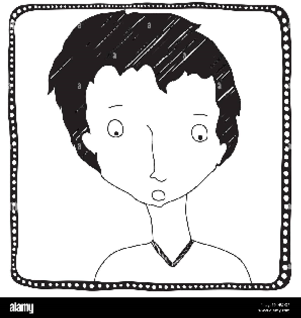

# Tornike Sharvashidze



## [My Portfolio](https://portfolio-tornikesharvashidze.netlify.app/)

## Contact Info

|          |                                                                                     |
| -------- | ----------------------------------------------------------------------------------- |
| Phone    | +995 555 309 444                                                                    |
| Email    | tornik2@yahoo.com                                                                   |
| Discord  | Tornike (@tornik2)                                                                  |
| LinkedIn | [Tornike Sharvashidze](https://www.linkedin.com/in/tornike-sharvashidze-19a245187/) |

## Skills

- JS
- CSS
- HTML

## Code Exapmle

```js
funtction sayHi(name) {
    return `Hi, ${name}`
}
```

## Education

- Medical University — M.D. (2016–2022)
- Rolling Scopes School — Frontend Course (2025 – in progress)

## Languages

| Language | Level  |
| -------- | ------ |
| Georgian | Native |
| English  | B2     |
| German   | B1     |
| Russian  | A2     |
